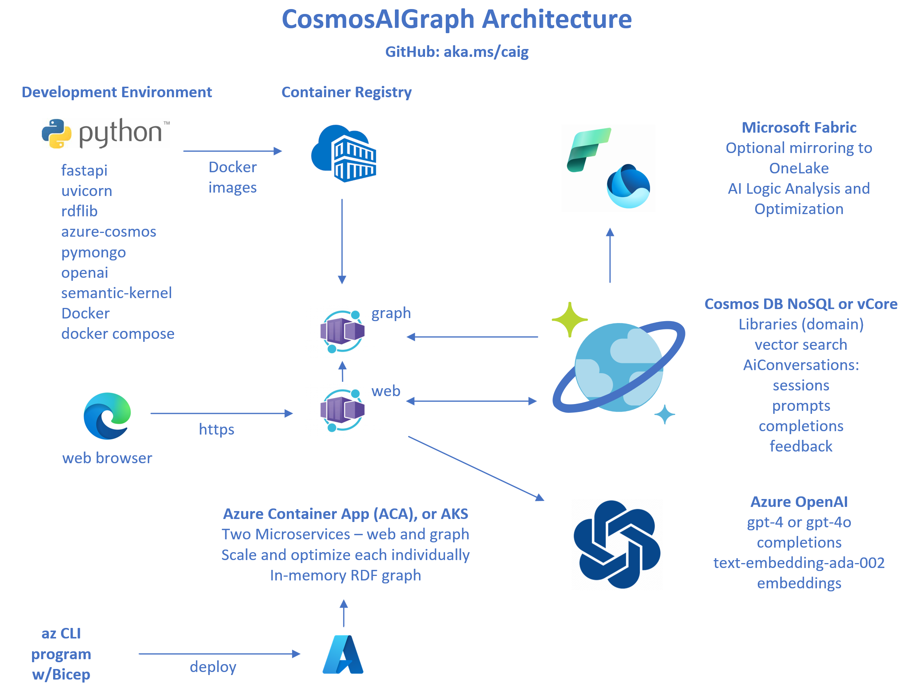

# CosmosAIGraph : Application Architecture

  

---

## Application Components

- Microservices
  - web microervice - UI front end
  - graph microservice - Contains the in-memory rdflib graph and AI functionality
- Azure Container App - Runtime orchestrator for the above two microservices
- Cosmos DB NoSQL or Mongo vCore API - Domain data and conversational AI documents, embeddings
- Azure OpenAI - completions and embeddings service

