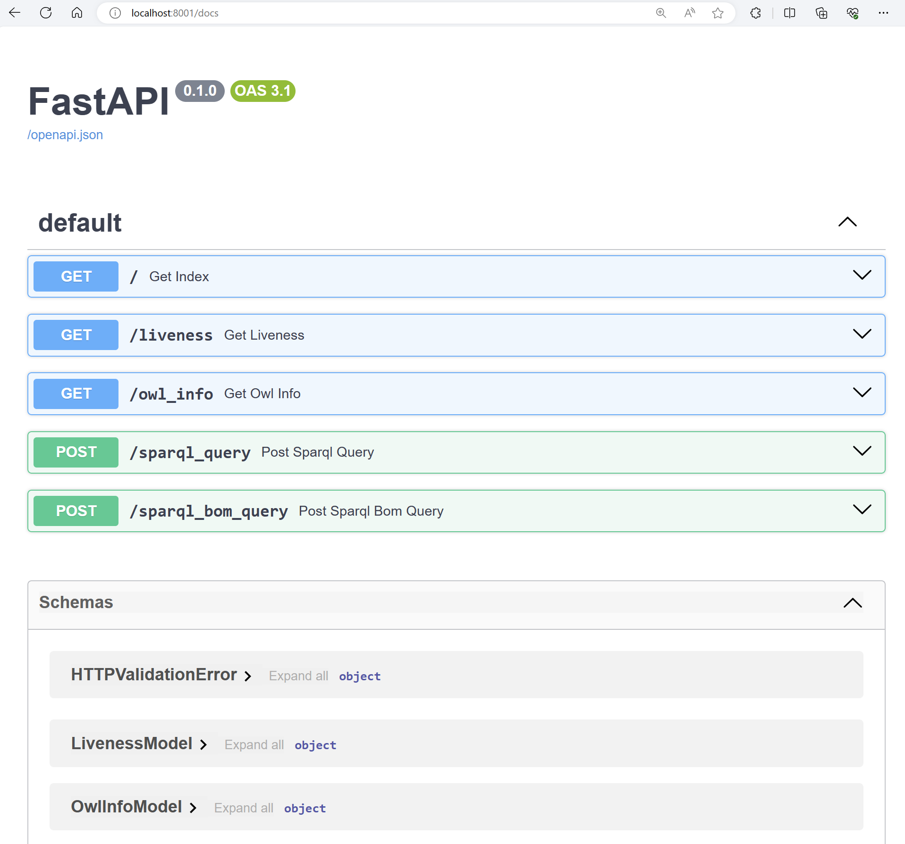

# CosmosAIGraph : FastAPI Framework and Endpoint Documentation

## FastAPI

This CosmosAIGraph reference implementation is entirely written in **Python3**
and all microservices utilize the [FastAPI](https://fastapi.tiangolo.com/) web framework.

FastAPI is a modern and **asynchronous** web framework, and is seen as the
successor to Flask.  It is also greatly simpler than the Django web framework,
which is oriented toward RDBMS-backed web applications.

## Automated Endpoint Documentation

With FastAPI, you can leverage the [Pydantic](https://docs.pydantic.dev/latest/)
library to define your endpoint requests and responses as Pydantic Models
as described here: https://fastapi.tiangolo.com/tutorial/body-nested-models/

This can enable automatic generation of [OpenAPI/Swagger](https://swagger.io/specification/)
documentation that is useful to the producers and consumers of your microservices.

You can invoke the FastAPI-created **/docs** endpoint to see the
generated documentation.  An example is shown in the screen shot below.

---

  

---

This functionality can be disabled as described here:
https://fastapi.tiangolo.com/tutorial/metadata/#docs-urls

