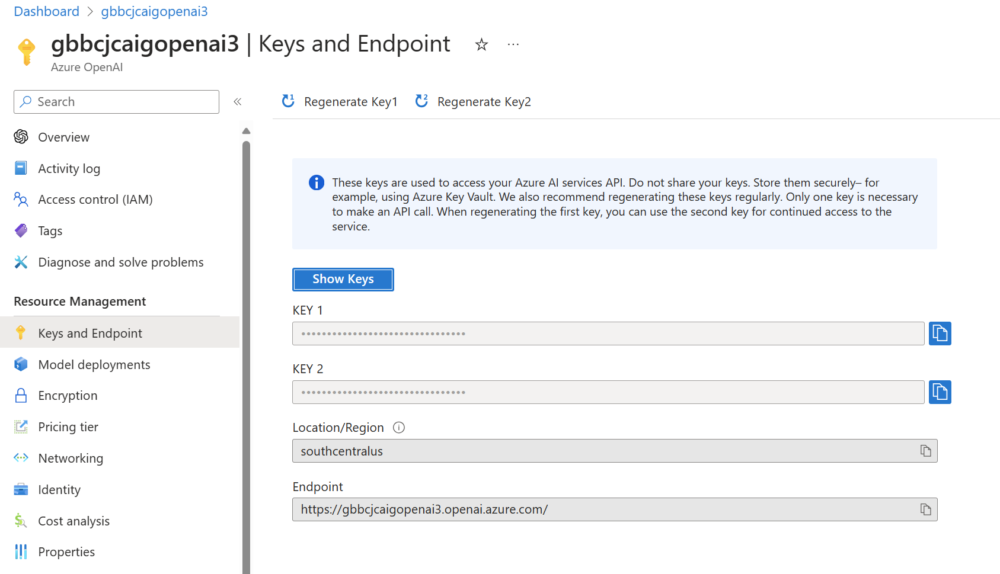
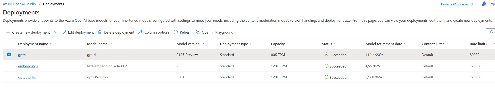

# CosmosAIGraph : Initial PaaS Provisioning

Though the provisioning of Azure PaaS services can be fully automated,
it is recommended that you deploy **Azure OpenAI** and **Azure Cosmos DB Mongo vCore**
manually in your subscription for this reference application.

The reason for this is that you may already have these resources deployed (i.e - Azure OpenAI)
and they may not be available in all regions.  Furthermore, you may face
Azure OpenAI model quota constraints.

## Azure OpenAI

In Azure Portal, go to Marketplace and search for "Azure OpenAI".
Proceed through the dialogs to provision this resource.

Once it is provisioned, navigate to the Resource Management -> Keys and Endpoint
page within the account as shown below.

<p align="center">
  
</p>

Capture the values of the endpoint URL and Key 1.  You will later
set your **CAIG_AZURE_OPENAI_URL** and **CAIG_AZURE_OPENAI_KEY**
environment variables with these values.

Create model deployments for the **gpt-4** and **text-embedding-ada-002** models.
It is expected that, over time, the names of these models will change,
so use the current version of each.

<p align="center">
  
</p>

You should set your **CAIG_AZURE_OPENAI_COMPLETIONS_DEP** and 
**CAIG_AZURE_OPENAI_EMBEDDINGS_DEP** environment variables to the
deployment names of these two models in your Azure OpenAI account.

<pre>

</pre>

## Azure Container Registry (ACR)

See https://learn.microsoft.com/en-us/azure/container-registry/.

When you build the Docker images for your application they should
be your ACR.

The example Bicep deployment scripts in this repository use
**DockerHub** for this public reference implementation.
However, you should use your private and secure Azure Container Registry instead.

<pre>

</pre>

## Azure Cosmos DB Mongo vCore

In Azure Portal, go to Marketplace and search for "Azure Cosmos DB".
Select "Azure Cosmos DB for Mongo DB" on the first page:

<p align="center">
  
</p>

<pre>
</pre>

Then select "vCore Cluster" on the second page as shown below.

<p align="center">
  
</p>

Choose the Cluster Tier of your choice.  The Free Tier or M25 Tier will be adequate
for this reference application.

Be sure to record the **Admin Username** and **Password** values that you provide.
These values will be needed to form the connection string.

### Obtain/Set the Connection String

After the Azure Cosmos DB Mongo vCore account has been created, navigate to
it in your Azure Portal and navigate to the "Settings -> Connection Strings"
page as shown below.  

<p align="center">
  
</p>

Copy the "Connection string" value on that page into a text editor; 
it should look like the following.  Edit the part of the connection
string with the content "user:password" and substitute the 
**Admin Username** and **Password** that you specified above when
creating the account.

#### Raw Connection String from Azure Portal

```
mongodb+srv://<user>:<password>@<your-account-name>.mongocluster.cosmos.azure.com/?tls=true&authMechanism=SCRAM-SHA-256&retrywrites=false&maxIdleTimeMS=120000
```

#### Sample Edited Connection String from Azure Portal

```
mongodb+srv://chris:secret@<your-account-name>.mongocluster.cosmos.azure.com/?tls=true&authMechanism=SCRAM-SHA-256&retrywrites=false&maxIdleTimeMS=120000
```

Save this edited connection string value.  You will later
set your **CAIG_AZURE_MONGO_VCORE_CONN_STR** environment variable with this value.
