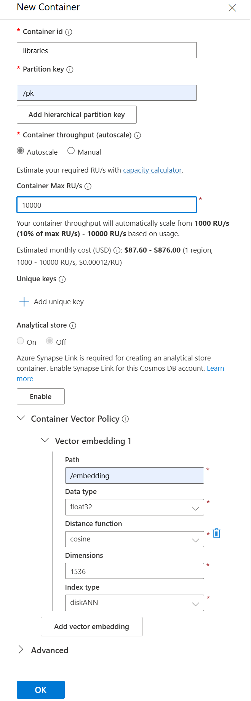

# CosmosAIGraph : Load Azure Cosmos DB NoSQL

## Configuration

This page assumes that you have set the following environment variables:

```
CAIG_GRAPH_SOURCE_TYPE              <-- must be set to 'cosmos_nosql'
CAIG_COSMOSDB_NOSQL_URI             <-- this value is unique to your Azure deployment
CAIG_COSMOSDB_NOSQL_KEY1            <-- Read/Write key value

CAIG_GRAPH_SOURCE_DB                <-- defaults to 'caig'
CAIG_GRAPH_SOURCE_CONTAINER         <-- defaults to 'libraries'
CAIG_CONFIG_CONTAINER               <-- defaults to 'config'
CAIG_CONVERSATIONS_CONTAINER        <-- defaults to 'conversations'
CAIG_FEEDBACK_CONTAINER             <-- defaults to 'feedback'
```

## Create the Cosmos DB NoSQL Containers

Use Azure Portal to create the **caig** database and the several
containers within it, listed below.  This can later be automated
with your provisioning toolset of choice - Bicep, ARM, Terraform, etc..

### The Libraries Container

First create the **libraries** container, with a **diskANN vector index**,
as shown in this screen shot.  This is an example of a **domain data**
container that contains your vectorized "business data".

<p align="center">
  
</p>

### The Other Containers 

Also manually create these three containers in the **caig** database.

| Container      | Partition Key Attribute | Request Units   |
| -------------- | ----------------------- | --------------- |
| config         | /pk                     | 4000 autoscale  |
| conversations  | /pk                     | 10000 autoscale |
| feedback       | /conversation_id        | 4000 autoscale  |

The **config** container will contain one document which identifies
the entities in this system.  This is used by classes **EntitiesService**
and **StrategyBuilder** to analyze user-specified natural-language queries.

The **conversations** and **feedback** containers record the evolving
state of AIConversations.  These containers will be useful for 
performing analysis and optimization of your AI logic - models, prompts, etc..
Mirroring this data to OneLake in Microsoft Fabric may be a cost-effective
solution.

---

## Load the entities document into the config container

This step will load one document into the **config** container.
The document contains a list of the known entities in the system.

```
> python main_nosql.py load_entities caig config
```


The input file/document is **impl/data/entities/entities_doc.json**, 
which looks like the following:

{
  "id": "entities",
  "pk": "entities",
  "created_at": 1724621802.222312,
  "created_date": "2024-08-25 17:36:42.222312",
  "docs_read": 10855,
  "elapsed_seconds": "0.454175900",
  "exception": "",
  "libraries": {
    "aiotask-context": "pypi",
    "pyxirr": "pypi",
    "price-parser": "pypi",
    "rl-renderpm": "pypi",
    "mypy-boto3-lexv2-models": "pypi",
    ... many other libraries ...
  }
}

This list of entities is used in class EntitiesService and StrategyBuilder.
For your CosmosAIGraph implementation, create and upload a similar file.

## Load the Library data into Cosmos DB NoSQL

Navigate to the **impl\app** directory of this repo and execute
the following commands:

```
> .\venv.ps1                      <-- create the python virtual environment

> .\venv\Scripts\Activate.ps1     <-- activate the python virtual environment

> python main_nosql.py load_libraries caig libraries 999999

2024-09-05 12:27:28,239 - load_libraries, dbname: caig, cname: libraries, max_docs: 999999
2024-09-05 12:27:28,239 - CosmosNoSQLService - constructor
2024-09-05 12:27:28,282 - CosmosNoSQLService - initialize() completed
2024-09-05 12:27:28,724 - reading file 0 of 10854: ../data/pypi/wrangled_libs/2captcha-python.json
2024-09-05 12:27:28,744 - reading file 1 of 10854: ../data/pypi/wrangled_libs/2to3.json
2024-09-05 12:27:28,759 - reading file 2 of 10854: ../data/pypi/wrangled_libs/a2wsgi.json
2024-09-05 12:27:28,774 - reading file 3 of 10854: ../data/pypi/wrangled_libs/aadict.json
2024-09-05 12:27:28,782 - reading file 4 of 10854: ../data/pypi/wrangled_libs/aafigure.json
2024-09-05 12:27:28,797 - reading file 5 of 10854: ../data/pypi/wrangled_libs/ablog.json
2024-09-05 12:27:28,812 - reading file 6 of 10854: ../data/pypi/wrangled_libs/about-time.json
2024-09-05 12:27:28,830 - reading file 7 of 10854: ../data/pypi/wrangled_libs/aboutcode-toolkit.json
2024-09-05 12:27:28,852 - reading file 8 of 10854: ../data/pypi/wrangled_libs/absl-py.json
2024-09-05 12:27:28,872 - reading file 9 of 10854: ../data/pypi/wrangled_libs/acachecontrol.json
2024-09-05 12:27:30,290 - load_batch 1 with 10 documents, results: {"201": 10}
2024-09-05 12:27:30,290 - current totals: {"document_files_read": 10, "201": 10}
... many batches of 10 documents each loaded ...
```

### Execute a Vector Search with the loaded data

First generate an embedding value from the words: 
"asynchronous web framework with pydantic".
Then use that embedding in a vector search vs the Cosmos DB
libraries container.

```
> python main_nosql.py vector_search_words asynchronous web framework with pydantic

...
doc 0: {'pk': 'pypi', 'id': 'pypi_fastapi', 'name': 'fastapi', 'libtype': 'pypi', 'score': 0.817302858227684}
doc 1: {'pk': 'pypi', 'id': 'pypi_flask_pydantic', 'name': 'flask-pydantic', 'libtype': 'pypi', 'score': 0.8144557229062142}
doc 2: {'pk': 'pypi', 'id': 'pypi_falcon', 'name': 'falcon', 'libtype': 'pypi', 'score': 0.8098353146347737}
doc 3: {'pk': 'pypi', 'id': 'pypi_async_asgi_testclient', 'name': 'async-asgi-testclient', 'libtype': 'pypi', 'score': 0.8090871851235626}
...
```

Notice that the **FastAPI** library is correctly identified as the top semantic search result.

