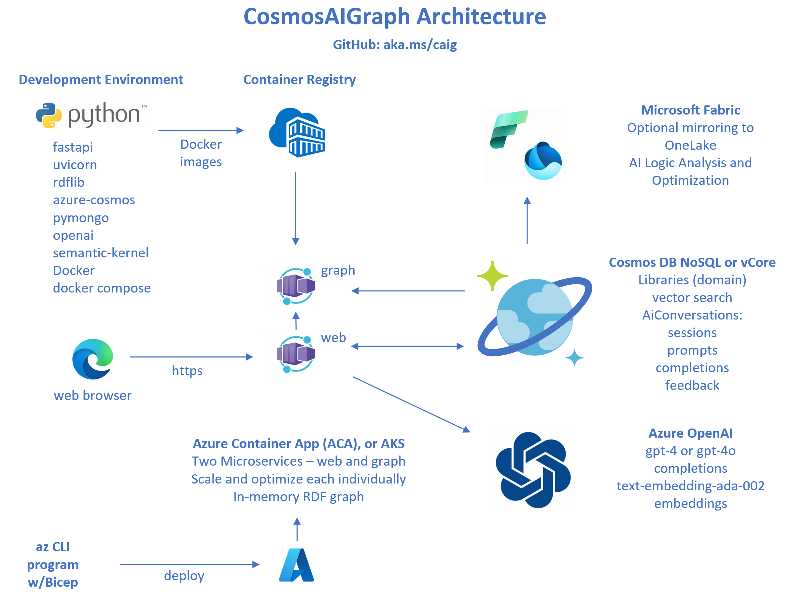

<p align="center">
  
</p>


---

The **CosmosAIGraph (caig)** application is deployed as these two microservices:

| Name   | Functionality                                                          |
| ------ | ---------------------------------------------------------------------- |
| web    |  Web Application microservice, user-facing, HTML oriented              |
| graph  |  Graph Microservice, JSON microservices over an in-memory rdflib graph |

These are located in the **app_web**, and **app_graph** directories
of this repository.

These are Docker-containerized with the **caig_** prefix.  Therefore, the container
names will be **caig_web**, and **caig_graph**.

## Implementation Summary

- **Python3** is used exclusively in the CosmosAIGraph solution
  - See https://www.python.org
- **FastAPI** is used exclusively as the framework for the web and http services
  - See https://fastapi.tiangolo.com
- **Azure Cosmos DB** is used as the persistent OLTP datastore
  - One or more Cosmos DB APIs may be part of your solution
  - See https://learn.microsoft.com/en-us/azure/cosmos-db/
  - You can use either the **Cosmos DB Mongo vCore or NoSQL APIs**
    - https://learn.microsoft.com/en-us/azure/cosmos-db/mongodb/vcore/
  - Your domain data, with embeddings, are stored here
  - AI sessions, prompt history, feedback, and completion history is persisted here
  - This Cosmos DB data can optionally be mirrored to OneLake in Microsoft Fabric
- **Azure OpenAI** is used for AI and LLM functionality
  - See https://learn.microsoft.com/en-us/azure/ai-services/openai/
- **semantic-kernel** is use for AI and LLM orchestration
  - See https://learn.microsoft.com/en-us/semantic-kernel/overview/
- **rdflib** is used as the high-performance in-memory graph
  - See https://rdflib.readthedocs.io/en/stable/
- **SPARQL 1.1** is the graph query language
  - See https://www.w3.org/TR/sparql11-query/
- **Web Ontology Language (OWL)** is the graph schema/ontology definition language
  - See https://www.w3.org/OWL/

---

## Quick Start

### Clone this GitHub Repository

Open a PowerShell Terminal, navigate to the desired parent directory
and execute the following **git clone** command.  This will copy the
contents of the public GitHub repository to your workstation.

If you don't have **git** installed on your system, please see the
[Developer Workstation Setup](developer_workstation.md) page.

```
> git clone https://github.com/cjoakim/CosmosAIGraph.git

> cd CosmosAIGraph

> Get-Location
```

The output value from the **Get-Location** will be a fully-qualified
directory path on your workstation.  Please set the **CAIG_HOME**
environment variable to this directory path value.

```
echo 'setting CAIG_HOME'
[Environment]::SetEnvironmentVariable("CAIG_HOME", "...your value from Get-Location ...", "User")
```

You will need to restart your Terminal for the above command to take effect.

You'll see in a section below that this CosmosAIGraph reference application
uses several environment variables, and they all begin with **CAIG_**.

### Provision Azure Cosmos DB and Azure OpenAI 

- See [Initial PaaS Provisioning](initial_paas_provisioning.md)

### Developer Workstation Setup

- See [Developer Workstation Setup](developer_workstation.md)

- See [Environment Variables](environment_variables.md)

### Load Cosmos DB with Library and Config Documents

- See [Cosmos DB Document Design and Modeling](cosmos_design_modeling.md)
- See [Load Azure Cosmos DB vCore](load_cosmos_vcore.md)
- See [Load Azure Cosmos DB NoSQL](load_cosmos_nosql.md)

### Run the Application on your Workstation

- See [Local Execution](local_execution.md)

- See [Explore the FastAPI Framework and Endpoint Documentation](fastapi_endpoint_docs.md)

- See [Understanding the Code](understanding_the_code.md)

### Azure Container App Deployment

- See [Deploying the Azure Container App](aca_deployment.md)

### Screen Shots of the Current Implementation

- See [Screen Shots](screen_shots.md)

---

## Next Steps: Customizing this Solution for Your Application

It is recommended that CosmosAIGraph Proof-of-Concept (POC) team
has the following skillsets:

- A data analysist who is familiar with your input graph data
- A data engineer who can wrangle/transform the raw data into JSON documents for Cosmos DB
- A Python developer with UI skills

- See [Customizing this Solution](customizing_this_solution.md)

- See [Code Generation](code_generation.md)

