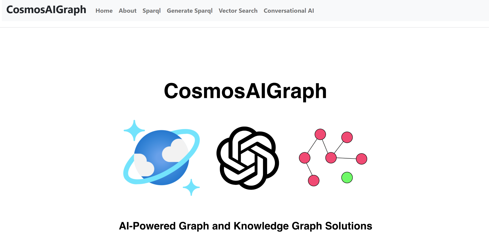
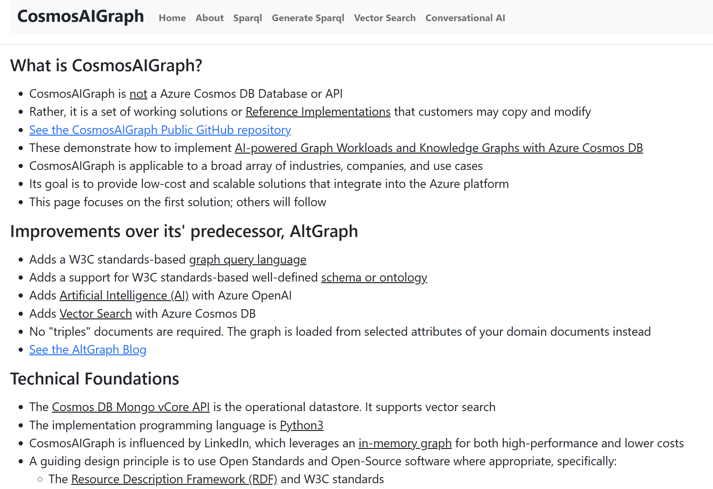
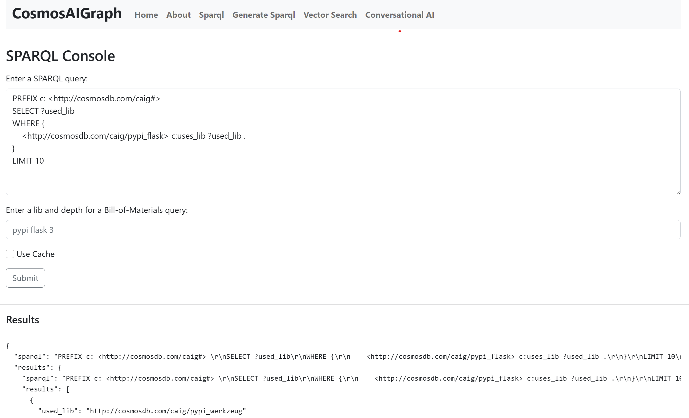
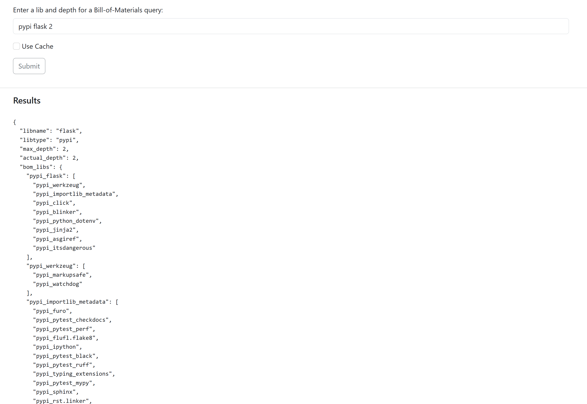
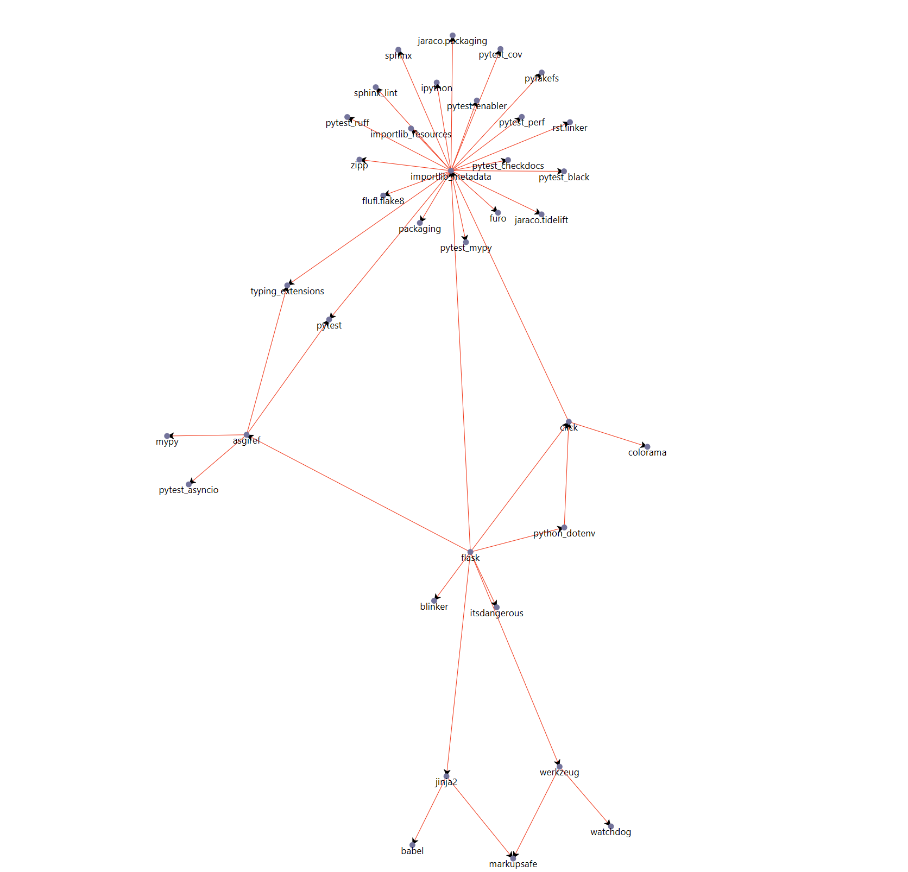
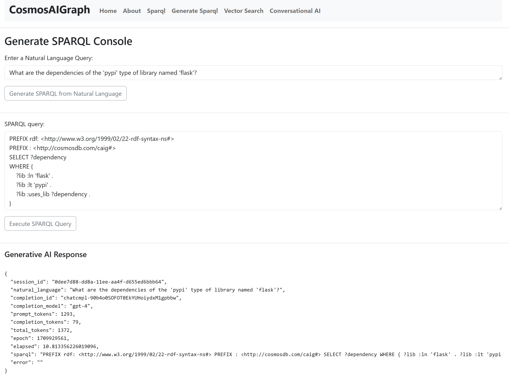
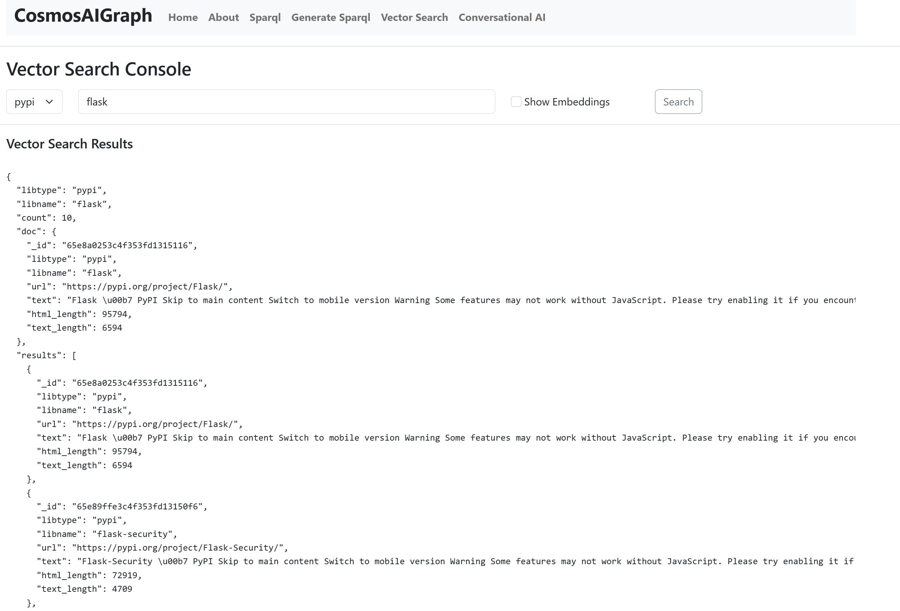
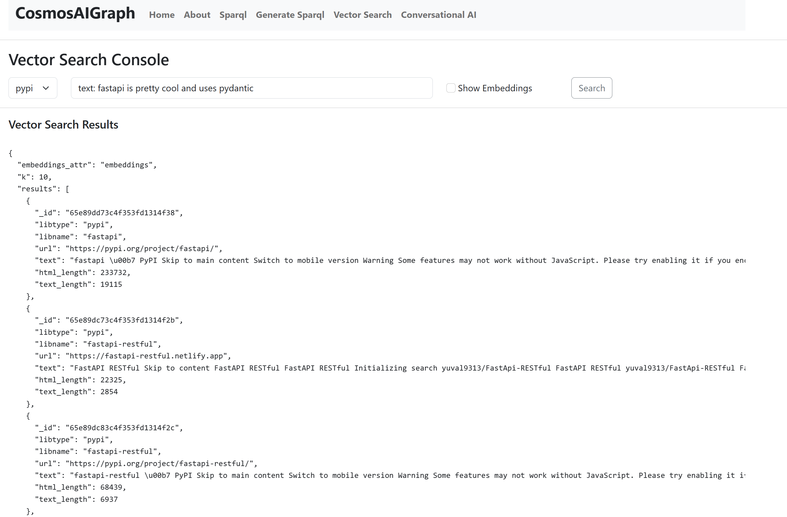
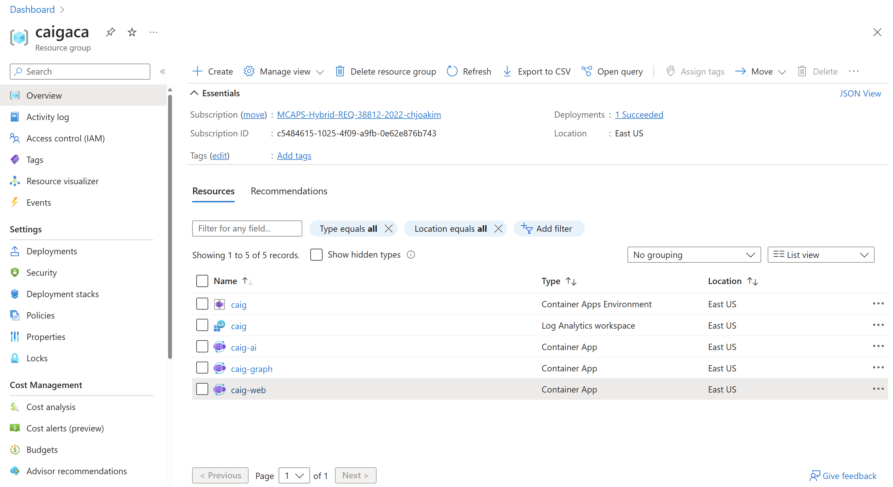

# CosmosAIGraph : Screen Shots

## Home Page 

  

---

## About Page 

  

---

## Sparql Console Page 

A SPARQL query and its' results.

  

---

A bill-of-material query of the Python Flask library.

  

---

D3.js visualization of the Python Flask library bill-of-material graph.

  

---

## Generate Sparql Console Page 

A working SPARQL query generated by Azure Open AI from a 
given OWL Ontology and user-specified natural language.

  

---

## Vector Search Console Page 

Vector search using the already existing embeddings for a given library.

  

Vector search using natural language that is vectorized, then passed
to the vector search.

  

---

## Azure Container App in Azure Portal 

  

