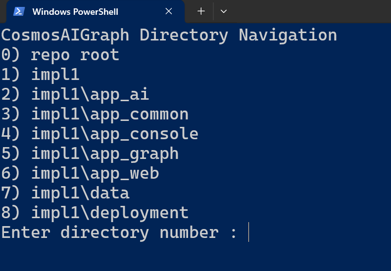
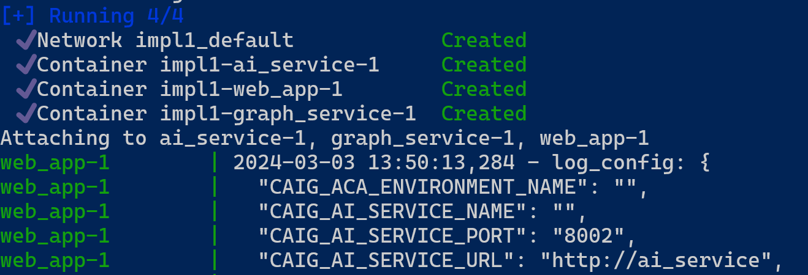
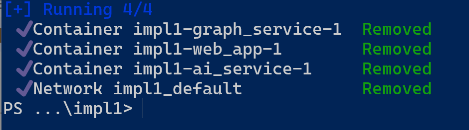

# CosmosAIGraph : Local Execution

**This page is oriented toward Software Engineers** who want to explore and
execute this application on their workstation.

Other users may simply wish to deploy the pre-build Docker containers
to an Azure Container App as described [here](aca_deployment.md).

## Unzip file libraries-graph.zip

The full-size libraries-graph.nt (triples) file is too large for GitHub.
Therefore it has been zipped and added to this repo as file 
impl1/app_graph/rdf/libraries-graph.zip.  Navigate to this directory
and unzip this file such that file **impl1/app_graph/rdf/libraries-graph.nt**
exists

## Modes of Execution

Three different modes of execution are recommended, please use the mode
most natural to your development style.

The three modes are:

- **Microservice-per-Terminal**
- **Launcher Script**
- **Docker Compose**

## Microservice-per-Terminal

In this mode, you manually create two Terminal windows, navigate to each,
create/activate the python virtual environment, and start the webapp.ps1
or websvc.ps1 script.

These two microservice directories in this repo are:

- impl1\app_graph
- impl1\app_web

The [Directory Navigation Script](directory_navigation_ps1.md) may be useful
to you in this mode.

<p align="center">
  
</p>

Be sure to modifify your environment variables, such as with the .env file,
before starting the microservices.

Also be sure to create and activate the Python Virtual Environment
in each of these two microservice directories.

## Launcher Script

In this mode, simply execute the **.\run.ps1** script in the **impl1**
directory of this repository.  It will create all two Terminal windows
and launch one microsoervice in each window.

Be sure to modifify your environment variables, such as with the .env file,
before starting the microservices.

## Docker Compose

This is the recommended solution as you near deployment of your application to Azure.
This approach executes the application packaged as **Docker Containers** rather
than as local files.

Start your **Docker Destop** application if it's not already running.

Be sure to modify your environment variables in the **docker-compose.yml** 
before starting the microservices.

Create two PowerShell Terminal windows, and navigate to the **impl1** directory in each.

In the first terminal window, execute the following command to start the application
(both microservices).

```
docker compose -f docker-compose.yml up
```

You should should see verbose output that includes the following:

<p align="center">
  
</p>

---

In the second terminal window, execute the following command to terminate the application.

```
docker compose -f docker-compose.yml down
```

You should should see verbose output that includes the following:

<p align="center">
  
</p>

---

### The Docker Containers

These two pre-built Docker containers exist on **DockerHub**.

- cjoakim/caig_web:latest
- cjoakim/caig_graph:latest

These are used by default by the above **docker-compose** script
and also by the **Azure Container App** deployment process.

If you wish to rebuild these containers and deploy them to your own Registry,
please see the **impl1/docker-builds.ps1** and **impl1/docker-builds.sh**
scripts in this repository.  You're free to modify these as necessary.
