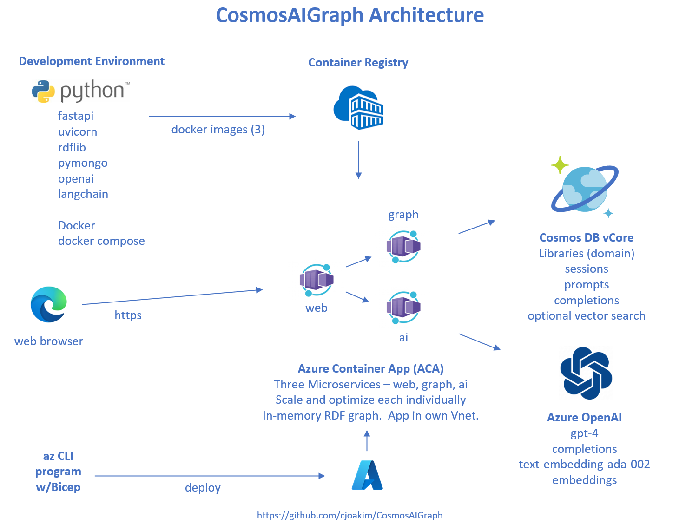

<p align="center">
  
</p>

---

**Note:** The initial March 2024 release of CosmosAIGraph is focused on **graph workloads**.
Subsequent releases will further implement **AI-powered** functionality with the
langchain orchestration library.
---

The **CosmosAIGraph (caig)** application, implementation 1, is deployed as these three microservices:

| Name   | Functionality                                                          |
| ------ | ---------------------------------------------------------------------- |
| web    |  Web Application microservice, user-facing, HTML oriented              |
| graph  |  Graph Microservice, JSON microservices over an in-memory rdflib graph |
| ai     |  AI Microservice, JSON microservices or OpenAI and LangChain logic     |

These are located in the **app_web**, **app_graph**, and **app_ai** directories
of this repository.

These are Docker-containerized with the **caig_** prefix.  Therefore, the container
names will be **caig_web**, **caig_graph**, and **caig_ai**.

## Implementation Summary

- **Python3** is used exclusively in the CosmosAIGraph solution
  - See https://www.python.org
- **FastAPI** is used exclusively as the framework for the web and http services
  - See https://fastapi.tiangolo.com
- **Azure Cosmos DB** is used as the persistent OLTP datastore
  - One or more Cosmos DB APIs may be part of your solution
  - See https://learn.microsoft.com/en-us/azure/cosmos-db/
  - Implementation 1 uses the **Cosmos DB Mongo vCore API**
    - https://learn.microsoft.com/en-us/azure/cosmos-db/mongodb/vcore/
  - AI sessions, prompt history, and completion history is stored here
- **Azure OpenAI** is used for AI and LLM functionality
  - See https://learn.microsoft.com/en-us/azure/ai-services/openai/
- **LangChain** is use for AI and LLM orchestration
  - See https://www.langchain.com
- **rdflib** is used as the high-performance in-memory graph
  - See https://rdflib.readthedocs.io/en/stable/
- **SPARQL 1.1** is the graph query language
  - See https://www.w3.org/TR/sparql11-query/
- **Web Ontology Language (OWL)** is the graph schema/ontology definition language
  - See https://www.w3.org/OWL/

## Directory Structure

Given the above microservices, this GitHub repository has this directory structure:

```
├── app_ai              # The AI microservice
├── app_common          # Common Python code developed and tested here
├── app_console         # Ad-hoc console app for data wrangling, etc.
├── app_graph           # The Graph microservice
├── app_web             # The Web Application microservice
└── deployment          # Azure Container App (ACA) Bicep-based deployment scripts
├── docker-builds.ps1   # script to build all three Docker images on Windows 11 w/PowerShell
├── docker-builds.sh    # script to build all three Docker images in macOS & Linux w/bash
├── docker-compose.yml  # Docker Compose script to run the three microservices locally
└── deployment          # Azure Container App (ACA) Bicep-based deployment scripts
└── mongosh*            # scripts to launch the mongo shell program, pointing at vCore
└── venv-builds*        # scripts to build the several python virtual environments in this implementation
```

The main development is done in the **app_common** directory.
Code is developed and unit-tested there.
Apache Ant script **deploy_master_code.xml** is used to copy this tested master code
to the several applications (app_web, app_graph, app_ai, etc.) that use this common/master code.

---

## Quick Start

### Clone this GitHub Repository

Open a PowerShell Terminal, navigate to the desired parent directory
and execute the following **git clone** command.  This will copy the
contents of the public GitHub repository to your workstation.

If you don't have **git** installed on your system, please see the
[Developer Workstation Setup](developer_workstation.md) page.

```
> git clone https://github.com/cjoakim/CosmosAIGraph.git

> cd CosmosAIGraph

> Get-Location
```

The output value from the **Get-Location** will be a fully-qualified
directory path on your workstation.  Please set the **CAIG_HOME**
environment variable to this directory path value.

```
echo 'setting CAIG_HOME'
[Environment]::SetEnvironmentVariable("CAIG_HOME", "...your value from Get-Location ...", "User")
```

You will need to restart your Terminal for the above command to take effect.

You'll see in a section below that this CosmosAIGraph reference application
uses several environment variables, and they all begin with **CAIG_**.

### Provision Azure Cosmos DB and Azure OpenAI 

- See [Initial PaaS Provisioning](initial_paas_provisioning.md)

### Developer Workstation Setup

- See [Developer Workstation Setup](developer_workstation.md)

- See [Environment Variables](environment_variables.md)

- See [Directory Navigation Script](directory_navigation_ps1.md)

### Load Cosmos DB with Library Documents

- See [Load Azure Cosmos DB vCore](load_cosmos_vcore.md)

### Run the Application on your Workstation

- See [Local Execution](local_execution.md)

- See [Explore the FastAPI Framework and Endpoint Documentation](fastapi_endpoint_docs.md)

- See [Understanding the Code](understanding_the_code.md)

### Azure Container App Deployment

- See [Deploying the Azure Container App](aca_deployment.md)

### Screen Shots of the Current Implementation

- See [Screen Shots](screen_shots.md)

---

## Next Steps: Customizing this Solution for Your Application

- See [Customizing this Solution](customizing_this_solution.md)

