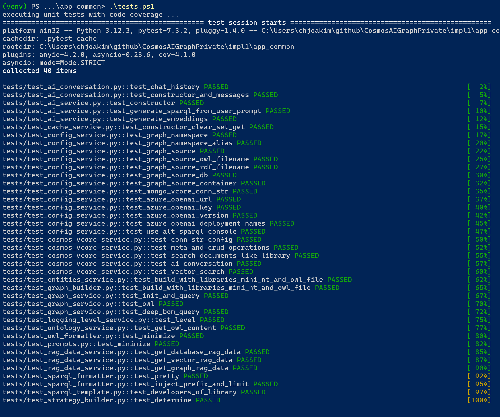

# CosmosAIGraph : Understanding the Code

This page strives to guide the reader in understanding both
the structure and implementation of this codebase.  Not every
python module is described here, only the most important ones.

Again, this is simply a **reference application** that you may
wish to refer to as you design and implement your own solitions.
Please feel free to use any part of this design and implementation,
or none.

## The app_common directory

This is where the common and reusable code for implementation is developed and tested.
Much of it is copied to the two microservice directories 
(i.e. - app_web and app_graph) as well as the other 
sub-applications (i.e - app_console) in an automated manner.

See script **impl1\app_common\deploy_master_code.ps1** which uses
**Apache Ant** to deploy the code from app_common to the other subprojects.

Unit tests are in the **impl1\app_common\tests** directory.
These use the [pytest](https://pypi.org/project/pytest/) library.
Test code coverage reports are created using the [pytest-cov](https://pypi.org/project/pytest-cov/)
library. 

See the **tests.ps1** and **tests.sh** scripts in the impl1\app_common directory.

The output of the tests looks like the following:

<p align="center">
  
</p>

### impl1\app_common\pysrc\models directory

File **webservice_models.py** contains the several **Pydantic models** 
that define both the request and response payloads for the web endpoints
in this application.

### impl1\app_common\pysrc\services directory

The classes here define the **business service** logic used by the application.

**config_service.py** returns all configuration values, such as environment variables,
for the application.

**ai_service.py** implements all Azure OpenAI and semantic-kernel logic.
The **generate_sparql_from_user_prompt** method in this module is where
the Azure OpenAI service is invoked to generate a SPARQL query from a
given OWL ontology and user prompt.

**cache_service.py** implements all (optional) caching of results such as SPARQL queries.

**cosmos_vcore_service.py** provides CRUD access to the Cosmos DB Mongo vCore database.

**graph_builder.py** utilizes the builder pattern to build an instance of
class GraphService, which contains an in-memory rdflib database.
The source data for building the graph consists of an Web Ontology File (OWL),
as well as either a RDF input file (i.e - *.nt) or a Cosmos DB Mongo vCore database.

These environment variables are used in building the in-memory rdflib graph:
- CAIG_GRAPH_SOURCE_TYPE
- CAIG_GRAPH_SOURCE_OWL_FILENAME
- CAIG_GRAPH_SOURCE_RDF_FILENAME
- CAIG_GRAPH_SOURCE_DB
- CAIG_GRAPH_SOURCE_CONTAINER
- CAIG_AZURE_MONGO_VCORE_CONN_STR 

Please see the [Environment Variables](environment_variables.md) page where
these are described.

It is worth taking a close look at graph_builder.py to see how the in-memory
rdflib graph is populated.  One approach uses an **RDF triples file** (i.e. - *.nt)
while the other loads the graph from **Cosmos DB** documents.

**graph_service.py** implements class GraphService which provides an interface
to all rdflib functionality including SPARQL queries.

An in-memory **rdflib** graph is mutable, but this reference implementation
does not demonstrate this.

**logging_level_service.py** defines the logic for returning a standard-library
logging level such as logging.DEBUG, logging.INFO, etc, per the environment
variable CAIG_LOG_LEVEL.  This solution uses the **logging** standard library
rather than print statements.

### impl1\app_common\pysrc\util directory

**fs.py** provides methods for accessing the local filesystem.

**owl_formatter.py** is used to return a minimized version of
a given OWL file content in order to be passed efficiently in an
AzureOpenAI system prompt.

**prompts.py** is used to define system and user prompts for 
Azure OpenAI.  This module is expected to evolve as the codebase
adds more semantic-kernel functionality.

**sparql_formatter.py** is used to return 'pretty' version of
a given (AI-generated) SPARQL query.

**sparql_template.py** is used render dynamic SPARQL queries from jinja2
templates and a dictionary of values.

### The FastAPI entry-point modules

The entry-point for the two microservices are:

- impl1/app_web/webapp.py
- impl1/app_graph/websvc.py

These two are very similar in that they create the FastAPI object,
load environment variables, configure logging, log the environment variables,
and define the HTTP endpoints.
The following is an example from the AI microservice.

```
# standard initialization
load_dotenv(override=True)
logging.basicConfig(
    format="%(asctime)s - %(message)s", level=LoggingLevelService.get_level()
)
ConfigService.log_defined_env_vars()

app = FastAPI()
ai_svc = AiService()
```

#### /liveness endpoints

Each microservice implements a **/liveness** HTTP GET endpoint that
can be executed by the container orchestration system (i.e - ACA or AKS)
to ensure the process is alive, and restart it if not.


#### Authorization and Authentication 

Since each customer organization is expected to have their own specific
security requirements, Authorization and Authentication is **not**
implemented in this reference application.

[msal](https://learn.microsoft.com/en-us/entra/msal/python/) is one
library you may wish to use to implement authorization and authencication
with [Microsoft Entra (AAD)](https://www.microsoft.com/en-us/security/business/identity-access/microsoft-entra-id).

On a networking level, however, the **Azure Container App** will user
use its' own, or an injected, Virtual network.  So the back-end microservices
can be defined as "internal" and not receive external network requests.

---

## Code formatting with the black library

The [black](https://pypi.org/project/black/) library is used to reformat
all python source code (i.e - the *.py files) into a standard and **pythonic**
style.  This can eliminate friction in Development teams by eliminating
personal coding style preferences.

See the **code-reformat.ps1** and **code-reformat.sh** scripts in the impl directory.
